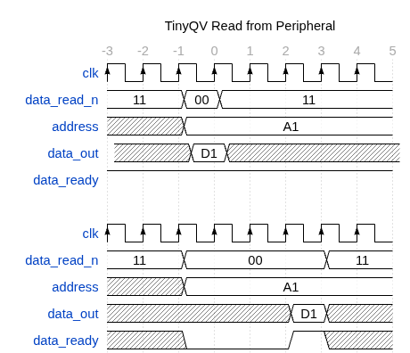
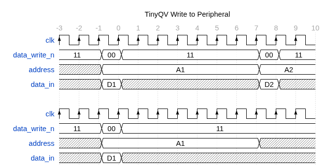

   

# TinyQV - A Risc-V SoC for Tiny Tapeout

TinyQV is accepting peripherals for tape out on the Tiny Tapeout [ttsky25a shuttle](https://app.tinytapeout.com/shuttles/ttsky25a) as part of the [Tiny Tapeout Risc-V peripheral challenge](https://tinytapeout.com/competitions/risc-v-peripheral/).

To contribute, start from either:
- The [byte peripheral template](https://github.com/TinyTapeout/tinyqv-byte-peripheral-template) for simpler peripherals, or
- The [full peripheral template](https://github.com/TinyTapeout/tinyqv-full-peripheral-template).

Further reading:
- [Documentation for project](docs/info.md)
- [More details about tinyQV](https://github.com/MichaelBell/tinyQV/tree/ttsky25a)
- [tinyQV-sdk for building tinyQV programs](https://github.com/MichaelBell/tinyQV-sdk)
- [Example tinyQV programs](https://github.com/MichaelBell/tinyQV-projects)
- [tinyQV Micropython](https://github.com/MichaelBell/micropython/tree/tinyqv-sky25a)

## TinyQV SoC Diagram

## Peripheral data transaction timing

### Read transactions

`data_read_n` signals when there is a read and indicates the transaction width, encoded as in RV32 load instructions: 0, 1 or 2 for 8, 16 or 32-bit.  3 means no transaction.

The read may complete synchronously on the same clock, or be delayed by any number of clocks while the peripheral prepares the data.  `data_ready` signals when the transaction is complete.  `data_out` is sampled on the next clock, its value does not have to be held constant for any additional clocks.  Data for 8 or 16-bit reads should always be aligned to the LSB of `data_out`, even for unaligned reads.

The top diagram shows a synchronous transaction, the bottom diagram shows a delayed transaction.

Reads from the peripheral (loads to TinyQV) happen at most once every 24 clocks.  As long as data_ready is signalled within 7 clocks there is no impact on maximum instruction throughput.

### Write transactions

Writes to the peripheral (stores from TinyQV) happen at most once every 8 clock cycles - the top diagram shows two writes as close together as possible.  The `address` is guaranteed to be stable for 8 clocks starting at the transaction.  Peripherals must accept writes, they can't delay the next transaction.

`data_write_n` signals when there is a write and indicates the transaction width, encoded as in RV32 store instructions: 0, 1 or 2 for 8, 16 or 32-bit.  3 means no transaction.

Data for 8 or 16-bit writes is aligned to the LSB of `data_in`, even for unaligned writes.

The `data_in` is modified between transactions, but due to the quad serial nature of TinyQV it is only modified 4 bits at a time, starting at the least significant bits.  Advanced users could rely on the upper bits being stable for additional clocks.

## What is Tiny Tapeout?

Tiny Tapeout is an educational project that aims to make it easier and cheaper than ever to get your digital and analog designs manufactured on a real chip.

To learn more and get started, visit https://tinytapeout.com.

## Set up your Verilog project

1. Add your Verilog files to the `src` folder.
2. Edit the [info.yaml](info.yaml) and update information about your project, paying special attention to the `source_files` and `top_module` properties. If you are upgrading an existing Tiny Tapeout project, check out our [online info.yaml migration tool](https://tinytapeout.github.io/tt-yaml-upgrade-tool/).
3. Edit [docs/info.md](docs/info.md) and add a description of your project.
4. Adapt the testbench to your design. See [test/README.md](test/README.md) for more information.

The GitHub action will automatically build the ASIC files using [OpenLane](https://www.zerotoasiccourse.com/terminology/openlane/).

## Enable GitHub actions to build the results page

- [Enabling GitHub Pages](https://tinytapeout.com/faq/#my-github-action-is-failing-on-the-pages-part)

## Resources

- [FAQ](https://tinytapeout.com/faq/)
- [Digital design lessons](https://tinytapeout.com/digital_design/)
- [Learn how semiconductors work](https://tinytapeout.com/siliwiz/)
- [Join the community](https://tinytapeout.com/discord)
- [Build your design locally](https://www.tinytapeout.com/guides/local-hardening/)

## What next?

- [Submit your design to the next shuttle](https://app.tinytapeout.com/).
- Edit [this README](README.md) and explain your design, how it works, and how to test it.
- Share your project on your social network of choice:
  - LinkedIn [#tinytapeout](https://www.linkedin.com/search/results/content/?keywords=%23tinytapeout) [@TinyTapeout](https://www.linkedin.com/company/100708654/)
  - Mastodon [#tinytapeout](https://chaos.social/tags/tinytapeout) [@matthewvenn](https://chaos.social/@matthewvenn)
  - X (formerly Twitter) [#tinytapeout](https://twitter.com/hashtag/tinytapeout) [@tinytapeout](https://twitter.com/tinytapeout)
